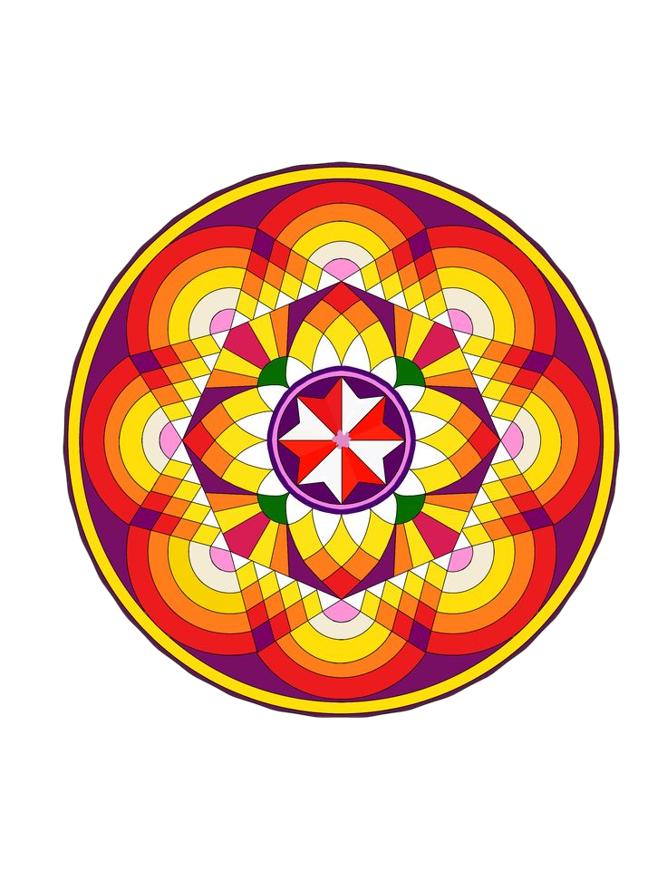

# 🌸 Poovum-Codeum (പൂവും കോഡും)
### *A Modern Interactive Digital Onam Pookalam Studio & Cultural Experience*

<p align="center">
  
</p>

<p align="center">
  <strong>Craft intricate floral carpets (Pookalam), explore Onam traditions, and share your floral art with the world.</strong>
</p>

<p align="center">
  <strong>🌐 Live Project URL: <a href="https://poovum-codeum-itye.vercel.app/" target="_blank">https://poovum-codeum-itye.vercel.app/</a></strong>
</p>

<p align="center">
  
  
  
  
</p>

---

## ✨ Features

### 🎨 1. Interactive Pookalam Creation & Coloring
- **Parametric Design Studio**: Generate customized floral mandalas with selectable sacred center core motifs (Ganapathi, Lotus, Om, Deepam), concentric ring layers, and outer border geometry.
- **Smart Vector & Pixel Fill**: Flood-fill individual mandala segments and annular ring bands with zero bleed and boundary-accurate coloring.
- **Rotational Symmetry Modes**: Paint in real-time with 4-fold, 8-fold, 12-fold, or 16-fold radial symmetry.
- **Custom Petal Stamping**: Place organic, naturally shaded botanical flower petals and green leaves anywhere across the canvas.

### 🍃 2. Traditional Taro Leaf Flower Palette (*വാഴയില / ചേമ്പില തട്ട്*)
- Features authentic flowers used during the 10 days of Onam:
  - 🤍 **Thumba Poovu** (*തുമ്പപ്പൂവ്*) — Lucas Aspera
  - 💛 **Mukkutti** (*മുക്കുറ്റി*) — Biophytum Sensitivum
  - 💙 **Shankhupushpam** (*ശംഖുപുഷ്പം*) — Butterfly Pea
  - 🌺 **Chemparathy** (*ചെമ്പരത്തി*) — Red Hibiscus
  - 🌼 **Chethi / Thechi** (*ചെത്തി*) — Flame of the Woods
  - 🏵️ **Marigold / Jamanthi** (*ചെണ്ടുമല്ലി / ജമന്തി*) — Yellow & Orange
  - 🌸 **Lotus Pink** (*താമര*) — Sacred Lotus
  - 🌿 **Green Taro Leaves** (*പച്ചില*) — Natural foliage base

### 🖼️ 3. Upload & Custom Outline Tracing
- Upload personal photos, sketches, or mandala drawings.
- In-browser image edge detection engine automatically converts photographs into interactive fillable outlines.

### 📜 4. Learn More About Onam (*ഓണം വിശേഷങ്ങൾ*)
- **Onasadya & Folk Arts**: Insights into traditional feasts, *Pulikali*, *Vallamkali* (snake boat races), and *Kathakali*.

### 🌐 5. Community Gallery & Export
- **Cloud Gallery Integration**: Publish created Pookalams directly to the global community gallery powered by **Supabase**.
- **High-Resolution Export**: Download finished Pookalam artworks as high-res PNGs or SVGs to share with friends and family.

---

## 🛠️ Tech Stack

- **Frontend Framework**: [React 19](https://react.dev/) + [Vite](https://vitejs.dev/)
- **Icons & UI Assets**: [Lucide React](https://lucide.dev/)
- **Animations & Micro-interactions**: [Framer Motion](https://www.framer.com/motion/) & [GSAP](https://gsap.com/)
- **Backend & Cloud Database**: [Supabase](https://supabase.com/)
- **Styling**: Vanilla CSS3 design system with Kerala brass & kasavu gold color palette

---

## 🚀 Quick Start

### Prerequisites
- [Node.js](https://nodejs.org/) (version 18+ recommended)
- [npm](https://www.npmjs.com/) or [pnpm](https://pnpm.io/)

### 1. Clone the repository
```bash
git clone https://github.com/Gayathrisubramanian06/Poovum-Codeum.git
cd Poovum-Codeum
```

### 2. Install dependencies
```bash
npm install
```

### 3. Setup Environment Variables
Create a `.env.local` file in the project root:
```env
VITE_SUPABASE_URL=https://your-supabase-project.supabase.co
VITE_SUPABASE_ANON_KEY=your-supabase-anon-key
```

### 4. Start Development Server
```bash
npm run dev
```
Open [http://localhost:5173](http://localhost:5173) in your browser.

---

## 📁 Project Structure

```
Poovum-Codeum/
├── public/
│   ├── assets/              # Icons, templates, and Onam illustrations
│   └── favicon.svg
├── src/
│   ├── components/
│   │   ├── Designer/        # Pookalam studio, canvas, templates, & custom builder
│   │   │   ├── CanvasStep.jsx
│   │   │   ├── CustomStep.jsx
│   │   │   ├── BrowserStep.jsx
│   │   │   ├── UploadStep.jsx
│   │   │   ├── TemplateStep.jsx
│   │   │   └── DesignerView.jsx
│   │   ├── HomeView.jsx     # Landing page with interactive hero
│   │   ├── AboutView.jsx    # Cultural guide & 10 days of Onam
│   │   ├── GalleryView.jsx  # Community gallery showcase
│   │   └── FlowerRenderer.jsx # High-fidelity botanical petal renderers
│   ├── utils/
│   │   ├── flowers.js       # Flower metadata, botanical colors, & descriptions
│   │   ├── mandalas.js      # Procedural mandala generation engine
│   │   ├── floodFill.js     # Canvas flood fill algorithm
│   │   ├── imageProcessor.js # Image to outline edge detection
│   │   └── supabase.js      # Supabase client configuration
│   ├── App.jsx              # Main routing & state container
│   ├── index.css            # Design tokens, gradients, & responsive styling
│   └── main.jsx
├── .env.local               # Supabase environment credentials
├── package.json
└── README.md
```

---

## 🌸 Flower Guide for Onam

| Day | Primary Flower | Malayalam Name | Cultural Significance |
| :--- | :--- | :--- | :--- |
| **Day 1: Atham** | Thumba | തുമ്പപ്പൂവ് | Symbol of simplicity and purity; starts with a single small circle. |
| **Day 2: Chithira** | Mukkutti & Thumba | മുക്കുറ്റി | Second layer added with yellow tones. |
| **Day 3: Chodhi** | Chemparathy | ചെമ്പരത്തി | Red hues introduced; Pookalam expands. |
| **Day 4: Vishakam** | Shankhupushpam | ശംഖുപുഷ്പം | Multi-colored intricate motifs. |
| **Day 5: Anizham** | Chethi / Thechi | ചെത്തി | Vibrant orange and flame patterns. |
| **Day 6: Thrikketta** | Marigold / Jamanthi | ചെണ്ടുമല്ലി | Large floral borders added. |
| **Day 7: Moolam** | Multi-flora | വിവിധ പൂക്കൾ | Intricate floral carpets created. |
| **Day 8: Pooradam** | Pyramid Onathappan | ഓണത്തപ്പൻ | Clay pyramid idols decorated with flowers. |
| **Day 9: Uthradam** | Grand Pookalam | ഉത്രാടപ്പൂക്കളം | Massive eve celebrations before Thiruvonam. |
| **Day 10: Thiruvonam** | Full Spectrum | തിരുവോണം | Grand celebration of King Mahabali's arrival. |

---

## 🤝 Contributing

Contributions, issues, and feature requests are welcome! Feel free to check the [issues page](https://github.com/Gayathrisubramanian06/Poovum-Codeum/issues).

---

## 📄 License

This project is licensed under the MIT License - see the [LICENSE](LICENSE) file for details.

<p align="center">
  Made with 💛 for Onam • <i>Happy Onam! (ഹൃദയം നിറഞ്ഞ ഓണാശംസകൾ!)</i>
</p>
